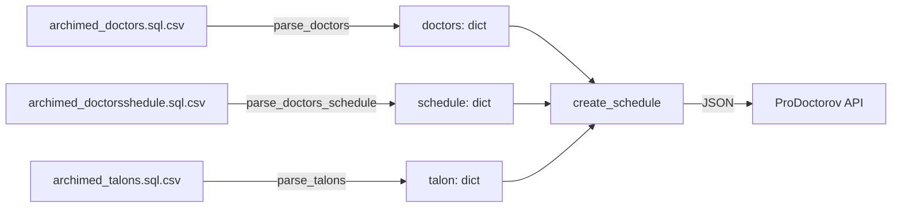

# Archimed → ProDoctorov Schedule Sync

Утилита для синхронизации расписания врачей: парсит CSV-выгрузки из медицинской информационной системы **Архимед** (доктора, рабочие смены, занятые талоны) и формирует из них нормализованное расписание свободных/занятых слотов, которое отправляется в API сервиса **ProDoctorov.ru**.

## О проекте

Архимед хранит расписание в собственном формате: дата — целое число (Delphi `TDateTime` / OLE Automation Date, эпоха `1899-12-30`), время — вещественное число как доля суток (`0.5` = `12:00`). ProDoctorov ожидает обычные строки `YYYY-MM-DD` и `HH:MM`, разбитые на слоты фиксированной длительности, с пометкой о занятости.

Проект закрывает разрыв между этими форматами: читает три CSV-таблицы, конвертирует единицы измерения, режет рабочий день на приёмные слоты заданной длительности, сверяет каждый слот с уже существующими талонами (записями на приём) и отправляет итоговый JSON одним POST-запросом.

## Как это работает



Пайплайн состоит из трёх этапов:

1. **Парсинг** (`parser.py`) — три CSV-файла превращаются в словари, индексированные по идентификатору врача.
2. **Построение расписания** (`create_schedule.py`) — рабочий день каждого врача режется на слоты, для каждого слота проверяется пересечение с талонами, дата и время конвертируются в читаемый формат.
3. **Отправка** (`request.py`) — итоговая структура отправляется на эндпоинт ProDoctorov с авторизацией по токену.

`main.py` связывает эти три этапа в единый сценарий запуска.

## Структура репозитория

| Файл | Назначение |
|---|---|
| `parser.py` | Чтение CSV-выгрузок Архимеда (врачи, смены, талоны) в Python-словари |
| `create_schedule.py` | Конвертация дат/времени, разбиение смены на слоты, разметка занятости |
| `request.py` | Отправка собранного расписания в ProDoctorov по HTTP |
| `main.py` | Точка входа, связывающая парсинг → сборку → отправку |

## Формат входных данных

### `archimed_doctors.sql.csv`
Справочник врачей. Используемые поля: `ID` (ключ), `ENABLED` (активность врача), `FULLNAME` (ФИО), `TIMESCALE` и `MAX_GET_TIME` (длительность приёма в минутах; если оба равны `0`, применяется значение по умолчанию — 30 минут).

### `archimed_doctorsshedule.sql.csv`
Рабочие смены врачей. Используемые поля: `DOCID` (ключ), `HIDEINTALONS` (скрыта ли смена из расписания), `SHIFTDATE` (дата смены, OLE-формат), `BEGINTIME` / `ENDTIME` (начало/конец смены, доля суток), `BEGINTIME_P` / `ENDTIME_P` (начало/конец перерыва, опционально).

### `archimed_talons.sql.csv`
Уже занятые приёмные талоны. Разделитель — `;`. Используемые поля: `DOCID` (ключ), `ENABLED`, `SHIFTDATE`, `BEGINTIME` / `ENDTIME` занятого интервала.

## Логика преобразования данных

- **Дата.** `create_year()` трактует число как OLE Automation Date (эпоха `1899-12-30` — стандартная для Delphi/Excel) и переводит его в `YYYY-MM-DD`.
- **Время.** `create_time_in_string()` умножает долю суток на количество секунд в сутках и округляет результат до минуты: если остаток секунд больше 5, время округляется вверх до следующей минуты.
- **Слоты.** `works_fragments()` нарезает интервал `[work_start, work_end]` на слоты заданной длительности; если задан перерыв, интервал делится на две части — до и после перерыва.
- **Занятость.** `is_busy()` помечает слот занятым, если он пересекается по времени хотя бы с одним талоном (классическая проверка пересечения интервалов).

## Установка

```bash
git clone <url-вашего-репозитория>
cd <repo>
python -m venv venv
source venv/bin/activate   # Windows: venv\Scripts\activate
pip install requests
```

## Конфигурация

Задана напрямую в коде


## Запуск

```bash
python main.py
```

Скрипт выведет время сборки расписания и результат HTTP-запроса (успех/код ошибки от API).
